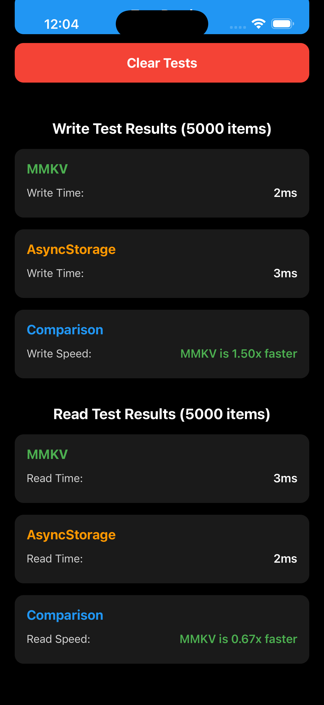

# MMKV vs AsyncStorage Performance TestThis is a new [**React Native**](https://reactnative.dev) project, bootstrapped using [`@react-native-community/cli`](https://github.com/react-native-community/cli).

This React Native project compares the performance of MMKV and AsyncStorage for read/write operations.# Getting Started

> **Note**: Make sure you have completed the [Set Up Your Environment](https://reactnative.dev/docs/set-up-your-environment) guide before proceeding.

## Performance Test Results (5000 items)## Step 1: Start Metro

### Write PerformanceFirst, you will need to run **Metro**, the JavaScript build tool for React Native.

- **MMKV**: 2ms

- **AsyncStorage**: 3msTo start the Metro dev server, run the following command from the root of your React Native project:

- **Result**: MMKV is **1.50x faster** for write operations

````sh

### Read Performance# Using npm

- **MMKV**: 3msnpm start

- **AsyncStorage**: 2ms

- **Result**: MMKV is **0.67x faster** (AsyncStorage is slightly faster for reads)# OR using Yarn

yarn start

## Summary```


The performance tests show that:## Step 2: Build and run your app

- MMKV excels at **write operations**, being 1.5x faster than AsyncStorage

- AsyncStorage performs slightly better at **read operations**With Metro running, open a new terminal window/pane from the root of your React Native project, and use one of the following commands to build and run your Android or iOS app:

- Both libraries handle 5000 items in just a few milliseconds, demonstrating excellent performance

### Android

## Getting Started

```sh

### Prerequisites# Using npm

npm run android

Make sure you have completed the [React Native environment setup](https://reactnative.dev/docs/set-up-your-environment).

# OR using Yarn

### Installationyarn android

````

1. Install dependencies:

```````sh### iOS

npm install

# orFor iOS, remember to install CocoaPods dependencies (this only needs to be run on first clone or after updating native deps).

yarn install

```The first time you create a new project, run the Ruby bundler to install CocoaPods itself:


2. Install iOS dependencies:```sh

```shbundle install

cd ios```

bundle install

bundle exec pod installThen, and every time you update your native dependencies, run:

cd ..

``````sh

bundle exec pod install

### Running the App```


```shFor more information, please visit [CocoaPods Getting Started guide](https://guides.cocoapods.org/using/getting-started.html).

# iOS

npm run ios```sh

# or# Using npm

yarn iosnpm run ios


# Android# OR using Yarn

npm run androidyarn ios

# or```

yarn android

```If everything is set up correctly, you should see your new app running in the Android Emulator, iOS Simulator, or your connected device.


## About MMKVThis is one way to run your app — you can also build it directly from Android Studio or Xcode.


MMKV is an efficient, small mobile key-value storage framework developed by WeChat. It provides:## Step 3: Modify your app

- Fast read/write operations

- Small memory footprintNow that you have successfully run the app, let's make changes!

- Support for multiple data types

- Encryption supportOpen `App.tsx` in your text editor of choice and make some changes. When you save, your app will automatically update and reflect these changes — this is powered by [Fast Refresh](https://reactnative.dev/docs/fast-refresh).


## About AsyncStorageWhen you want to forcefully reload, for example to reset the state of your app, you can perform a full reload:


AsyncStorage is an asynchronous, persistent, key-value storage system that is:- **Android**: Press the <kbd>R</kbd> key twice or select **"Reload"** from the **Dev Menu**, accessed via <kbd>Ctrl</kbd> + <kbd>M</kbd> (Windows/Linux) or <kbd>Cmd ⌘</kbd> + <kbd>M</kbd> (macOS).

- Part of React Native core- **iOS**: Press <kbd>R</kbd> in iOS Simulator.

- Simple to use

- Suitable for small to medium amounts of data## Congratulations! :tada:


## Learn MoreYou've successfully run and modified your React Native App. :partying_face:


- [MMKV GitHub](https://github.com/Tencent/MMKV)### Now what?

- [React Native AsyncStorage](https://react-native-async-storage.github.io/async-storage/)

- [React Native Documentation](https://reactnative.dev)- If you want to add this new React Native code to an existing application, check out the [Integration guide](https://reactnative.dev/docs/integration-with-existing-apps).

- If you're curious to learn more about React Native, check out the [docs](https://reactnative.dev/docs/getting-started).

# Troubleshooting

If you're having issues getting the above steps to work, see the [Troubleshooting](https://reactnative.dev/docs/troubleshooting) page.

# Learn More

To learn more about React Native, take a look at the following resources:

- [React Native Website](https://reactnative.dev) - learn more about React Native.
- [Getting Started](https://reactnative.dev/docs/environment-setup) - an **overview** of React Native and how setup your environment.
- [Learn the Basics](https://reactnative.dev/docs/getting-started) - a **guided tour** of the React Native **basics**.
- [Blog](https://reactnative.dev/blog) - read the latest official React Native **Blog** posts.
- [`@facebook/react-native`](https://github.com/facebook/react-native) - the Open Source; GitHub **repository** for React Native.
```````
