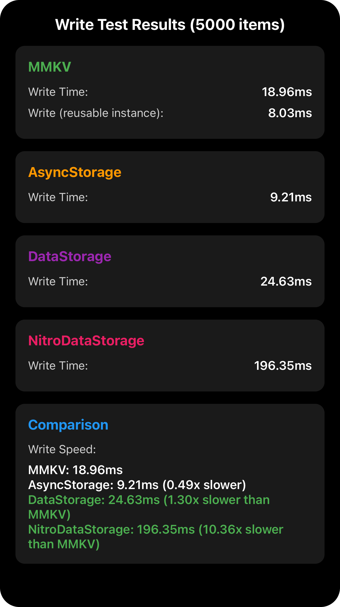
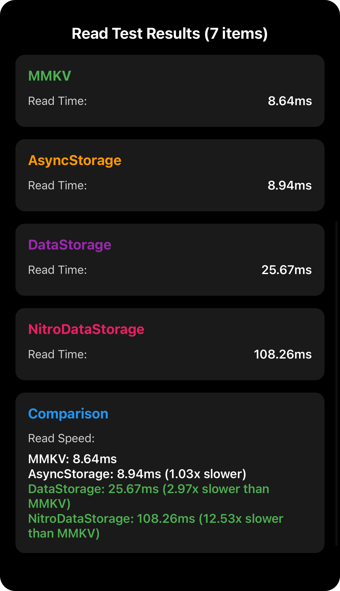
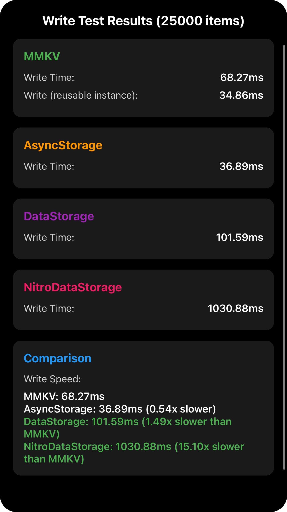
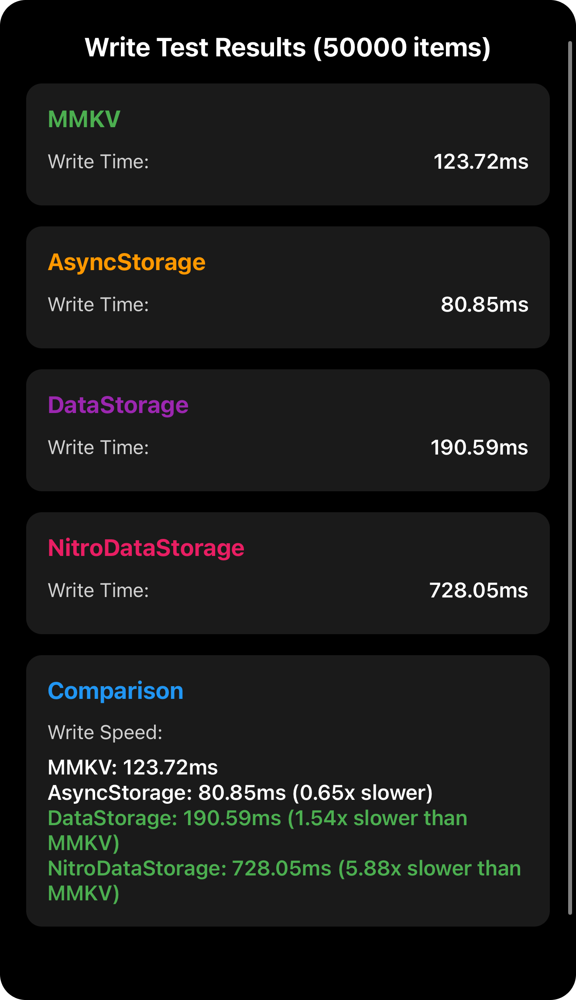
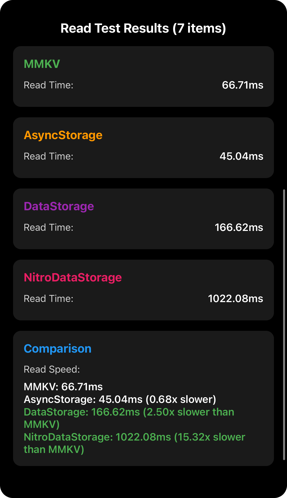
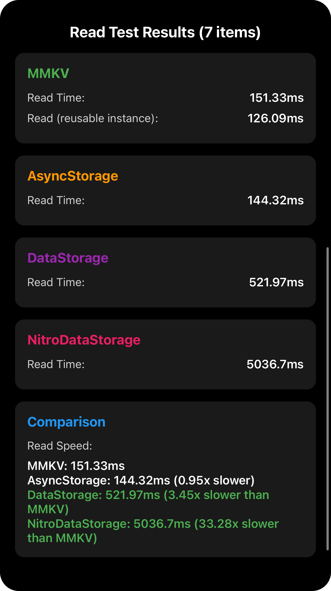

# React Native Storage Performance Comparison

This is a [**React Native**](https://reactnative.dev) project, bootstrapped using [`@react-native-community/cli`](https://github.com/react-native-community/cli), that compares the performance of four different storage solutions for read/write operations:

- **[React Native MMKV](https://github.com/mrousavy/react-native-mmkv)** - Fast key-value storage built on top of MMKV
- **[AsyncStorage](https://github.com/react-native-async-storage/async-storage)** - Asynchronous, persistent, key-value storage system
- **DataStorage (Turbo Modules)** - Custom implementation using React Native's new Turbo Modules architecture
- **NitroDataStorage (Nitro Modules)** - Custom implementation using Nitro Modules for zero-overhead native calls

## Test Results

### 5,000 Items

<div align="center">
  
  
</div>

### 25,000 Items

<div align="center">
  
  
</div>

### 50,000 Items

<div align="center">
  
  
</div>

### 150,000 Items

<div align="center">
  
  
</div>

## Performance Data

### Write Performance (ms)

| Items   | AsyncStorage | MMKV   | MMKV (Reusable) | DataStorage | NitroDataStorage |
| ------- | ------------ | ------ | --------------- | ----------- | ---------------- |
| 5,000   | 9.51         | 21.28  | **8.92**        | 26.07       | 203.38           |
| 25,000  | 36.59        | 64.15  | 40.88           | 102.94      | 1033.03          |
| 50,000  | 73.95        | 131.51 | **72.89**       | 202.52      | 2012.43          |
| 150,000 | 220.95       | 445.19 | **217.29**      | 603.05      | 6181.56          |

### Read Performance (ms)

| Items   | AsyncStorage | MMKV   | MMKV (Reusable) | DataStorage | NitroDataStorage |
| ------- | ------------ | ------ | --------------- | ----------- | ---------------- |
| 5,000   | 7.35         | 13.23  | 9.02            | 24.5        | 172.99           |
| 25,000  | 24.9         | 41.46  | 29.9            | 88.2        | 835.48           |
| 50,000  | 51.47        | 68.29  | **46.78**       | 174.82      | 1694.92          |
| 150,000 | 149.14       | 158.23 | **127.47**      | 530.29      | 5187.49          |

_Bold values indicate the fastest time for that test._

## About the Storage Solutions

### MMKV (react-native-mmkv)

A fast, efficient key-value storage library that uses JSON serialization. Stores data as strings and requires parsing on read operations. Supports a "reusable" buffer mode that significantly improves performance.

**Performance**: MMKV with reusable buffer is the fastest option in most tests, outperforming AsyncStorage in write operations (3/4 tests) and read operations at larger data sizes (2/4 tests).

### AsyncStorage

The standard asynchronous storage solution for React Native. Uses JSON serialization and provides a promise-based API.

**Performance**: Consistently fast and competitive. Best for read operations at smaller data sizes. Native JSON serialization optimizations provide excellent baseline performance.

### DataStorage (Turbo Modules)

A custom implementation built using React Native's **Turbo Modules** architecture:

- **Direct object storage** - No JSON serialization/deserialization required
- Stores objects natively without string conversion
- Uses React Native's new architecture for improved bridge communication
- Asynchronous operations through promises

**Performance**: 2-3x slower than AsyncStorage. The bridge overhead and object serialization costs outweigh the benefits of direct object storage.

### NitroDataStorage (Nitro Modules)

A custom implementation built using **Nitro Modules**:

- **Zero-overhead native calls** - Direct JavaScript-to-native communication
- **Synchronous operations** - No async/await overhead
- **Direct object storage** - No JSON serialization needed
- Leverages the most modern React Native architecture

**Performance**: Currently 20-35x slower than AsyncStorage. The implementation may have performance issues that need optimization. Despite the theoretical advantages of synchronous calls and zero overhead, the current implementation underperforms significantly.

## Key Findings

Based on the performance tests across different data sizes (5k, 25k, 50k, and 150k items):

1. **MMKV (Reusable Buffer)** is the fastest option for most operations:

   - Fastest write operations in 3 out of 4 tests (5k, 50k, 150k items)
   - Fastest read operations at larger data sizes (50k, 150k items)
   - Up to 14% faster than AsyncStorage for writes at scale
   - Up to 15% faster than AsyncStorage for reads at scale

2. **AsyncStorage** remains highly competitive:

   - Fastest write at 25k items (36.59ms vs 40.88ms)
   - Fastest read at smaller sizes (5k, 25k items)
   - Excellent baseline performance with native JSON optimizations
   - Reliable choice when MMKV reusable buffer isn't available

3. **MMKV (Standard)** is 40-100% slower than MMKV Reusable:

   - Write operations: 1.6x-2.4x slower than reusable mode
   - Read operations: 1.2x-1.5x slower than reusable mode
   - Still faster than DataStorage and NitroDataStorage

4. **DataStorage (Turbo Modules)** is 2-4x slower than AsyncStorage:

   - Write operations: 0.34x-0.37x the speed of AsyncStorage
   - Read operations: 0.28x-0.30x the speed of AsyncStorage
   - The overhead of Turbo Modules bridge and object serialization outweighs the benefits

5. **NitroDataStorage (Nitro Modules)** shows unexpectedly poor performance, 20-35x slower than AsyncStorage:

   - Write operations: 0.03x-0.05x the speed of AsyncStorage
   - Read operations: 0.03x-0.04x the speed of AsyncStorage
   - Despite synchronous operations, the current implementation has significant performance issues

**Conclusion**: For storing large state trees (as done in redux-persist), **MMKV with reusable buffer** is the clear winner when available, with AsyncStorage as an excellent alternative. Modern architectures (Turbo Modules and Nitro Modules) don't automatically guarantee better performance—implementation details and native optimizations matter more than the architecture itself.

## Getting Started

### Prerequisites

- **Node.js**: v20.12.0 or higher (required for React Native 0.82+)
  - Check your version: `node --version`
  - If you need to upgrade, use [nvm](https://github.com/nvm-sh/nvm): `nvm install 20 --latest-npm`
- Make sure you have completed the [React Native environment setup](https://reactnative.dev/docs/set-up-your-environment).

### Installation

1. Clone the repository:

```sh
git clone <repository-url>
cd mmkv-vs-async_storage
```

2. Install dependencies:

```sh
npm install
# or
yarn install
```

3. Install iOS dependencies:

```sh
cd ios
pod install
cd ..
```

### Running the App

1. Start Metro bundler:

```sh
npm start
# or
yarn start
```

2. In a new terminal, run the app:

```sh
npm run ios
# or
yarn ios
```

## Troubleshooting

### Node.js Version Error

If you encounter the error `(0 , _util.styleText) is not a function` when running `npm start`, this means your Node.js version is too old. React Native 0.82+ requires Node.js v20.12.0 or higher.

**Solution:**

1. Check your Node.js version: `node --version`
2. If you're using nvm, upgrade to the latest Node.js 20: `nvm install 20 --latest-npm`
3. If you're not using nvm, download and install Node.js v20.12.0+ from [nodejs.org](https://nodejs.org/)

### iOS Build Error (Error Code 70)

If you encounter `error Failed to build ios project. "xcodebuild" exited with error code '70'` when running `npm run ios`, this is typically related to code signing or provisioning profile issues.

**Solution:**

1. Open the project in Xcode:
   ```sh
   open ios/MmkvTest.xcworkspace
   ```
2. In Xcode, select your project in the navigator
3. Go to the **Signing & Capabilities** tab
4. Select your **Team** and ensure a valid provisioning profile is configured
5. If building for a physical device, make sure your device is registered in your Apple Developer account
6. Try building and running directly from Xcode

For other issues, see the [React Native Troubleshooting](https://reactnative.dev/docs/troubleshooting) page.

## Implementation Details

### Test Methodology

All storage solutions are tested using the same approach that mirrors real-world usage (similar to redux-persist):

1. Generate complex nested data structures (users, products, orders, UI state, session data)
2. Serialize entire state tree into a single storage operation
3. Store under a single root key
4. Read and deserialize the entire state tree

This approach tests realistic scenarios where apps store complete application state, not just individual key-value pairs.

### DataStorage Implementation

Located in `react-native-data-storage/`, this module demonstrates:

- Swift implementation for iOS (`DataStorageManager.swift`)
- Integration with React Native's Turbo Modules architecture
- Direct JSI (JavaScript Interface) object storage
- Asynchronous promise-based API

### NitroDataStorage Implementation

Located in `react-native-nitro-data-storage/`, this module demonstrates:

- Swift implementation for iOS (`HybridNitroDataStorage.swift`)
- Integration with Nitro Modules for zero-overhead calls
- Synchronous API (no async/await needed)
- Direct object storage with optimal performance

## Learn More

- [React Native MMKV](https://github.com/mrousavy/react-native-mmkv)
- [React Native AsyncStorage](https://react-native-async-storage.github.io/async-storage/)
- [React Native New Architecture](https://reactnative.dev/docs/the-new-architecture/landing-page)
- [Turbo Modules](https://reactnative.dev/docs/the-new-architecture/pillars-turbomodules)
- [Nitro Modules](https://github.com/mrousavy/nitro)
- [React Native Documentation](https://reactnative.dev)
